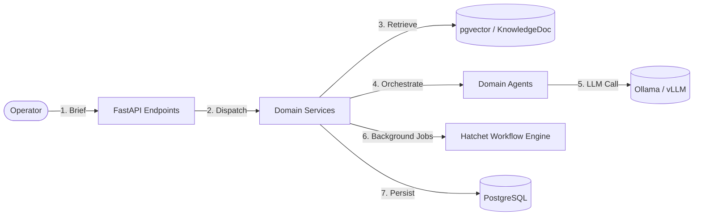

# CONTEXT.md — Ubiquitous Language & Domain Glossary

This document establishes the **shared domain vocabulary** for VibeAgent. All code symbols, database models, API schemas, agent prompts, and architectural discussions must adhere to the definitions and nomenclature defined here.

---

## 1. Core Domain Concepts

### Content Lifecycle
- **Brief**: A high-level input provided by a human user or campaign planner specifying the topic, target platform, tone, and goals for generating content.
- **Draft**: A newly generated post that has not yet been reviewed or approved for publishing.
- **Review Queue**: The staging area where drafts or automated actions with confidence below the threshold await human inspection and approval.
- **Approved**: A post explicitly vetted by a human operator or passing automatic high-confidence criteria, ready for scheduling.
- **Scheduled**: A post queued with a target publish timestamp to be dispatched by the scheduler.
- **Published**: A post successfully dispatched and confirmed live on the target platform (e.g., LinkedIn, X).
- **Failed**: A post dispatch attempt that encountered an unrecoverable error after retries.

### Lead Qualification & Engagement
- **Lead**: A prospective customer or contact identified from social interactions or manual creation.
- **Lead Stage**: The progression state in the sales qualification funnel:
  - `cold`: Initial stage; contact recognized with minimal engagement or low intent.
  - `warm`: Repeated engagement (likes, basic comments, profile visits).
  - `hot`: High-intent actions (questions about pricing, product capabilities, direct queries).
  - `mql` (Marketing Qualified Lead): Lead has achieved threshold score based on business criteria.
  - `sql` (Sales Qualified Lead): Lead vetted for handoff to a sales rep or direct booking.
  - `disqualified`: Contact determined not to be a fit (spam, competitors, out-of-scope).
- **Lead Score**: A dynamic integer score (0–100) calculated from profile fit, interaction frequency, intent signals, and sentiment.
- **Interaction**: An inbound event from a platform (e.g., comment, direct message, mention, quote, reaction).
- **Conversation**: An aggregated thread of interactions representing continuous dialogue between VibeAgent and a Lead.
- **Sentiment**: Normalized emotional polarity classification (`positive`, `neutral`, `negative`, `inquisitive`, `frustrated`).

### Knowledge & RAG
- **KnowledgeDoc**: A chunked document (e.g., brand guidelines, product specs, case studies, FAQs) stored with vector embeddings for semantic retrieval.
- **RAG Context**: Grounding snippets retrieved via pgvector cosine distance search to ensure LLM outputs reflect verified brand knowledge.
- **Embedding**: High-dimensional vector representation (e.g., 384-dim from `all-MiniLM-L6-v2`) used for similarity search.

### Execution & Agent Architecture
- **Agent**: An autonomous, task-specific AI module executing a bounded responsibility (e.g., `ContentGeneratorAgent`, `EngagementAgent`, `LeadQualifierAgent`).
- **Confidence Threshold**: A configurable float (`0.0` to `1.0`, default `0.85`). Actions scoring below this threshold require human intervention.
- **Workflow / Step Function**: Orchestrated async task pipelines managed by Hatchet with retry policies, state recovery, and distributed worker execution.
- **Seam**: A public interface boundary (API endpoints, public service methods) where automated tests observe behavior without coupling to internal implementation.

---

## 2. Terminology Mapping (Say This, Not That)

| Use This (Domain Term) | Avoid (Ambiguous / Generic) | Rationale |
|-------------------------|-----------------------------|-----------|
| **Lead** | User, Person, Customer, Prospect | Differentiates system users (operators) from external sales prospects. |
| **Operator** | User, Admin | Refers to the human marketing/sales user managing VibeAgent. |
| **Brief** | Prompt, Input, Description | Distinguishes human strategic requirements from low-level LLM system prompts. |
| **Draft** | Unapproved post, Temporary post | Standard publishing lifecycle terminology. |
| **Interaction** | Event, Message, Ping | Captures all multi-modal social touchpoints (DMs, comments, reactions). |
| **Lead Stage** | Status, Level, State | Aligns with standard CRM funnel stages. |
| **KnowledgeDoc** | Doc, Embed, File | Represents an indexed, searchable knowledge entity. |
| **Confidence Threshold**| AI cutoff, Review limit | Explicit probabilistic decision boundary. |

---

## 3. Key System Boundaries & Seams

---

## 4. Architectural Invariants
1. **Zero Hardcoding**: All URLs, model names, tokens, and thresholds are read from environment variables through `app.config.Settings`.
2. **Deterministic Schemas**: All public interfaces communicate via strict Pydantic v2 schemas.
3. **Async Native**: All I/O operations (DB via asyncpg, HTTP via httpx, Redis via redis-py async) must be asynchronous.
4. **No Hidden State**: Agents do not maintain persistent in-memory session state; state lives in PostgreSQL and Hatchet step outputs.
